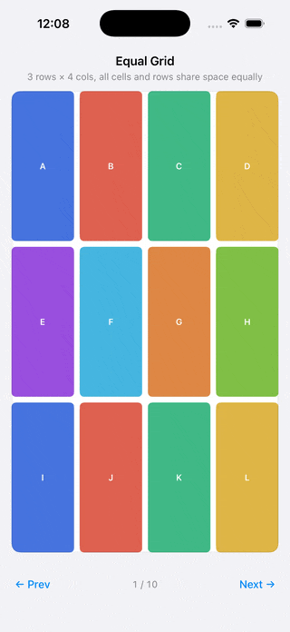

# ControlGrid

A generic 2D grid layout component for UIKit, built on `UIScrollView` with fully manual frame layout. Rows and cells are configured declaratively — giving you symmetric, composable control over both axes without fighting Auto Layout for scrolling or sizing decisions.



---

## Features

- **Per-row height specs** — fixed, flexible with min/max clamping, or unconstrained equal share
- **Per-cell width specs** — same model applied to the horizontal axis
- **Symmetric axes** — `GridDimension` drives both row heights and cell widths
- **Vertical scrolling** — automatically enabled when content exceeds bounds
- **Proportional horizontal shrink** — fixed cells shrink together when they overflow their row
- **Content alignment** — top, center, or bottom when content is smaller than bounds
- **Cell alignment per row** — leading, center, or trailing
- **Spacer cells** — pass `view: nil` for a cell that occupies space but renders nothing
- **Cascading defaults** — `nil` in a per-cell spec falls through to the row spec, then the grid defaults
- **Auto Layout for content** — cell container frames are manual; content views inside are pinned with Auto Layout

---

## Requirements

- iOS 12+
- UIKit
- Swift 5.7+

---

## Installation

Copy `ControlGrid.swift` into your project. No dependencies.

---

## Quick Start

A 4-column equally-fitted grid:

```swift
let grid = ControlGrid()
view.addSubview(grid)
// ... constrain grid to its container ...

grid.setRows([
    ControlGridRow(cells: [a, b, c, d].map { ControlGridCell(view: $0) }),
    ControlGridRow(cells: [e, f, g, h].map { ControlGridCell(view: $0) }),
])
```

All defaults apply: rows share available height equally, cells share row width equally, content is centered vertically, spacing is 8pt.

---

## Core Types

### `GridDimension`

Used for both row heights and cell widths.

```swift
enum GridDimension {
    case fixed(CGFloat)                          // exact size in points
    case flexible(min: CGFloat?, max: CGFloat?)  // share of remaining space, clamped
}
```

- `.fixed(80)` — always 80pt (subject to proportional shrink on horizontal overflow)
- `.flexible(min: 40, max: 80)` — gets an equal share of remaining space, clamped to [40, 80]
- `.flexible(min: nil, max: nil)` — unconstrained equal share (the default)

### `RowSpec`

Declares how a row lays out its height and cells.

```swift
struct RowSpec {
    var height: GridDimension                    // row height
    var horizontalAlignment: HorizontalAlignment // .leading / .center / .trailing
    var defaultCellWidth: GridDimension          // fallback width for cells in this row
    var cellSpacing: CGFloat?                    // nil = grid's defaultCellSpacing
    var cellInsets: UIEdgeInsets?                // nil = grid's defaultCellInsets
}
```

### `CellSpec`

Overrides for a single cell.

```swift
struct CellSpec {
    var width: GridDimension?    // nil = row's defaultCellWidth
    var insets: UIEdgeInsets?    // nil = row's cellInsets → grid's defaultCellInsets
}
```

### `ControlGridCell`

```swift
struct ControlGridCell {
    var view: UIView?    // nil = spacer (occupies space, renders nothing)
    var spec: CellSpec?  // nil = use row/grid defaults
}
```

### `ControlGridRow`

```swift
struct ControlGridRow {
    var cells: [ControlGridCell]
    var spec: RowSpec?  // nil = use grid's defaultRowSpec
}
```

The number of cells implicitly defines the column count. Each row can have a different number of cells.

### `ControlGrid`

```swift
class ControlGrid: UIScrollView {
    var defaultRowSpec: RowSpec         // fallback spec for rows without their own
    var rowSpacing: CGFloat             // vertical gap between rows (default: 8)
    var contentAlignment: ContentAlignment // top / center / bottom (default: .center)
    var defaultCellSpacing: CGFloat     // horizontal gap between cells (default: 8)
    var defaultCellInsets: UIEdgeInsets // content insets within cells (default: .zero)

    func setRows(_ rows: [ControlGridRow])
}
```

---

## Examples

### Mixed row heights

First row fixed at 44pt, remaining rows share available space up to 80pt max:

```swift
let grid = ControlGrid(
    defaultRowSpec: RowSpec(height: .flexible(min: 40, max: 80)),
    contentAlignment: .center
)

grid.setRows([
    ControlGridRow(
        cells: [headerView].map { ControlGridCell(view: $0) },
        spec: RowSpec(height: .fixed(44))
    ),
    ControlGridRow(cells: [a, b, c, d].map { ControlGridCell(view: $0) }),
    ControlGridRow(cells: [e, f, g, h].map { ControlGridCell(view: $0) }),
])
```

### Fixed-width cells with a spacer

Two 60pt buttons with a flexible gap between them:

```swift
ControlGridRow(cells: [
    ControlGridCell(view: leftButton,  spec: CellSpec(width: .fixed(60))),
    ControlGridCell(view: nil),   // spacer — takes all remaining width
    ControlGridCell(view: rightButton, spec: CellSpec(width: .fixed(60))),
])
```

### Centering a fixed-width item

Equal spacers on both sides center a 200pt view:

```swift
ControlGridRow(cells: [
    ControlGridCell(view: nil),
    ControlGridCell(view: titleLabel, spec: CellSpec(width: .fixed(200))),
    ControlGridCell(view: nil),
])
```

### Evenly distributed items with equal margins

Three spacers around two 60pt items — both items are centered as a pair:

```swift
ControlGridRow(cells: [
    ControlGridCell(view: nil),
    ControlGridCell(view: button1, spec: CellSpec(width: .fixed(60))),
    ControlGridCell(view: nil,     spec: CellSpec(width: .fixed(20))), // fixed inner gap
    ControlGridCell(view: button2, spec: CellSpec(width: .fixed(60))),
    ControlGridCell(view: nil),
])
```

### Spacer rows

An empty row with a fixed height acts as vertical whitespace:

```swift
ControlGridRow(
    cells: [],
    spec: RowSpec(height: .fixed(24))
)
```

### Per-row cell spacing and insets

```swift
ControlGridRow(
    cells: [a, b, c].map { ControlGridCell(view: $0) },
    spec: RowSpec(
        height: .fixed(60),
        cellSpacing: 16,
        cellInsets: UIEdgeInsets(top: 4, left: 4, bottom: 4, right: 4)
    )
)
```

---

## Overflow Behavior

| Axis | Behavior when content exceeds bounds |
|---|---|
| **Vertical (rows)** | Grid scrolls. Rows keep their declared or minimum heights. |
| **Horizontal (cells)** | Fixed cells shrink proportionally. No horizontal scroll. No clipping. |

Example: two `.fixed(100)` cells in a 150pt row → each becomes 75pt.

---

## Default Cascade

When a property is `nil`, the grid resolves it in this order:

```
CellSpec.width       → RowSpec.defaultCellWidth   → ControlGrid.defaultRowSpec.defaultCellWidth
CellSpec.insets      → RowSpec.cellInsets          → ControlGrid.defaultCellInsets
RowSpec.cellSpacing  →                               ControlGrid.defaultCellSpacing
ControlGridRow.spec  →                               ControlGrid.defaultRowSpec
```

---

## Layout Model

```
ControlGrid (UIScrollView)
└── rows stacked vertically with rowSpacing
    └── each row: cells laid out horizontally with cellSpacing
        └── each cell: CellContainer (manual frame)
            └── content view pinned via Auto Layout + insets
```

The grid owns row and cell positioning (manual frames). Content views inside cells adapt via Auto Layout, so they respond normally to size changes and can use their own internal constraints freely.

---

## License

MIT
